# PWA Note

線上展示(請使用手機開啟)

https://ivesshe.github.io/PWA_Basic/

## 安裝android studio

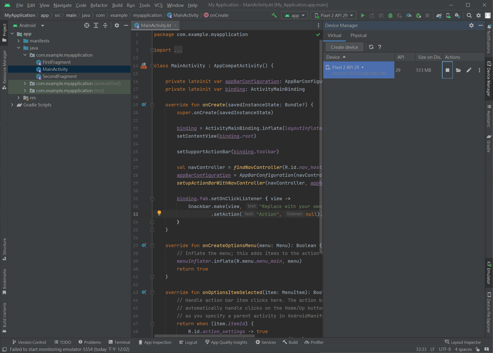

開啟一個虛擬安卓手機

## 電腦網址列輸入

chrome://inspect/#devices

使用remote devices調試工具

設定本機WEB端口，建立與虚擬機的連結

http://localhost:5500/

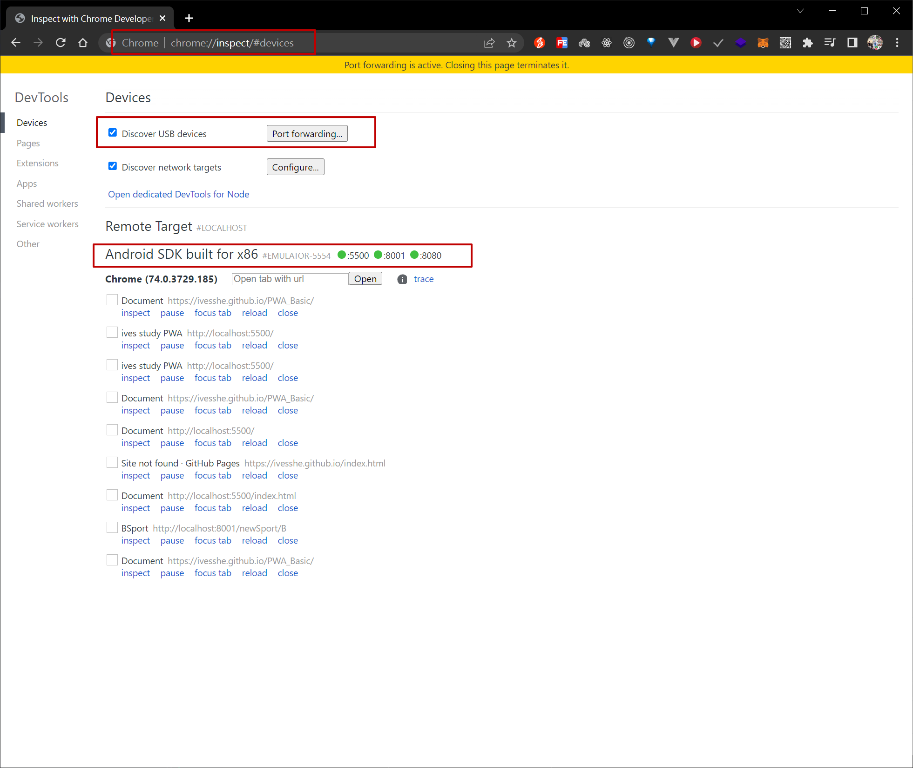

開啟虛擬機測試

# android測試、安裝及展示

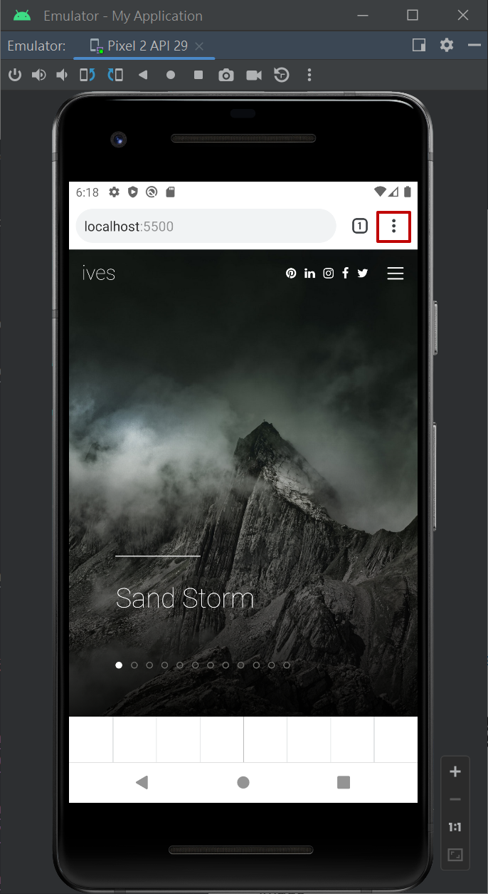

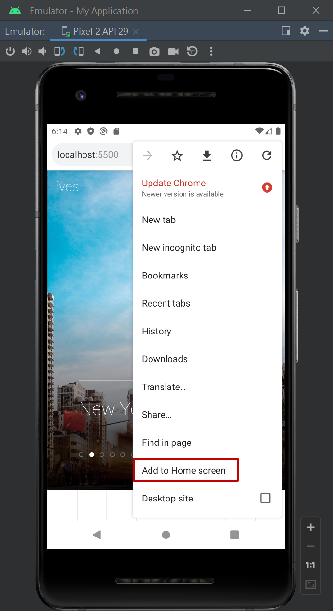

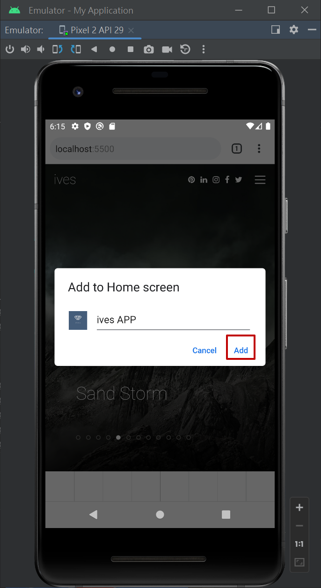

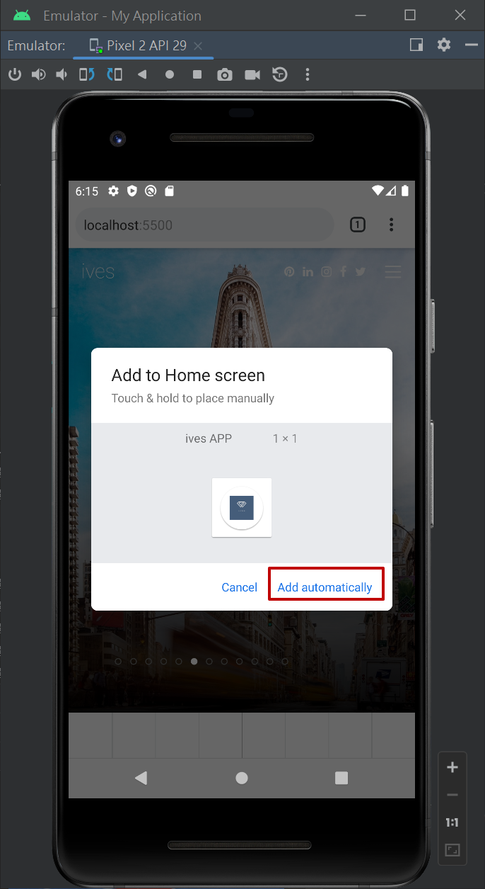

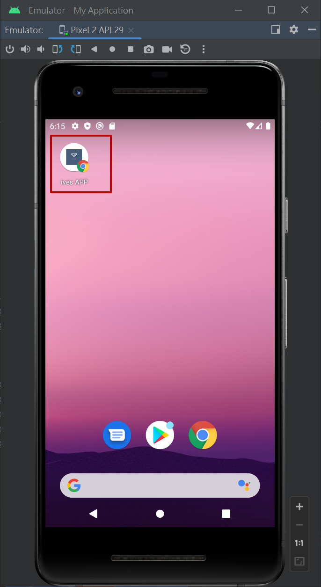

開啟畫面

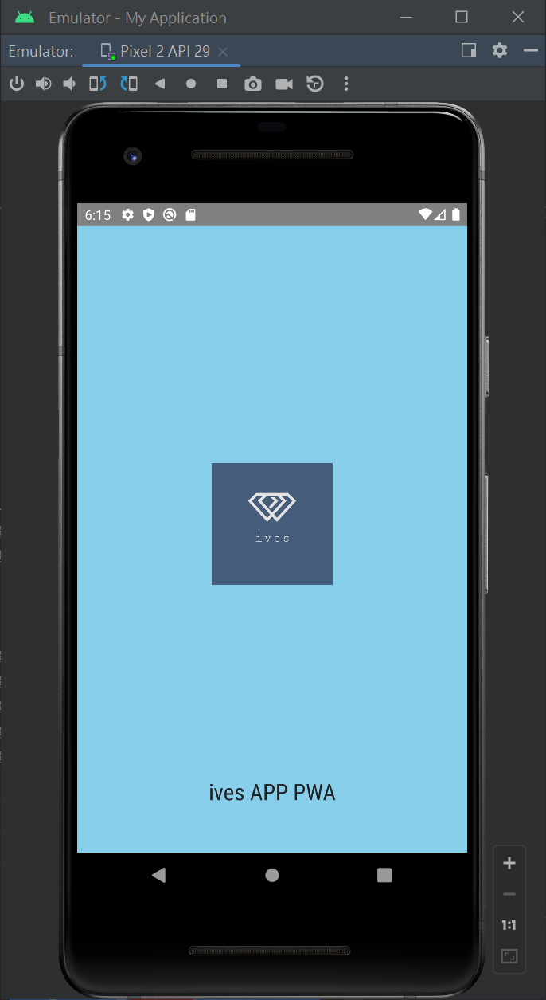

使用體驗與APP相同

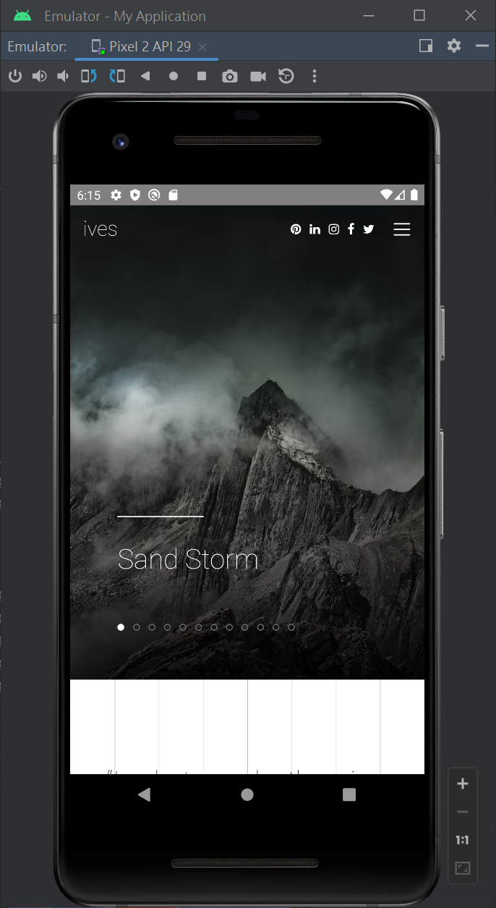

後台展示也與APP相同

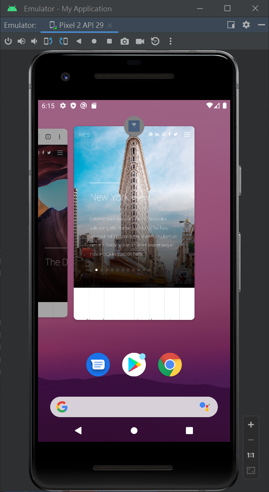

# 上傳至Github

https://ivesshe.github.io/PWA_Basic/

# IOS測試、安裝及展示

使用safari開啟

https://ivesshe.github.io/PWA_Basic/

點擊紅框處

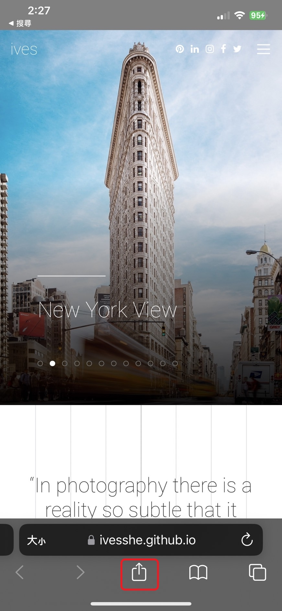

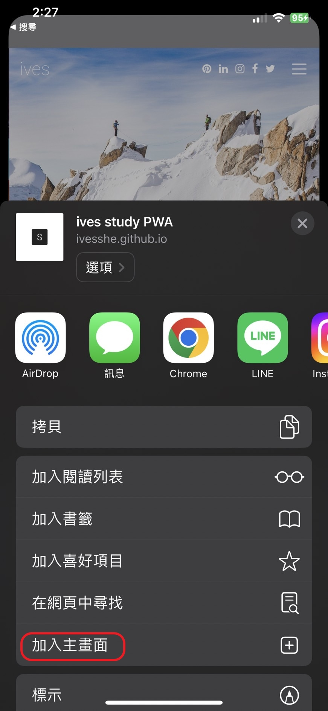

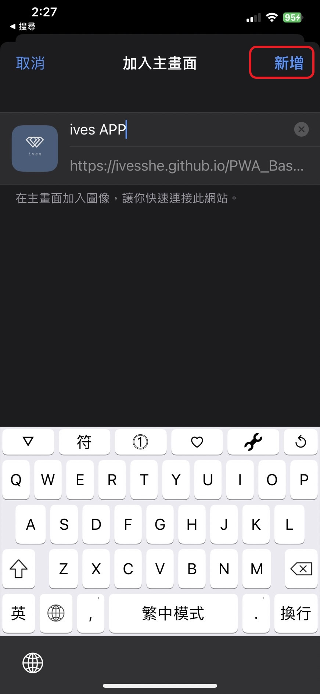

在畫面多了ives APP

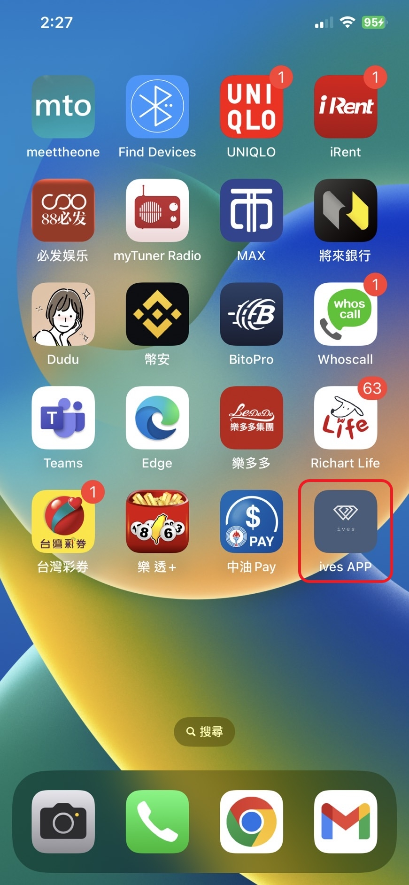

使用體驗與APP相同

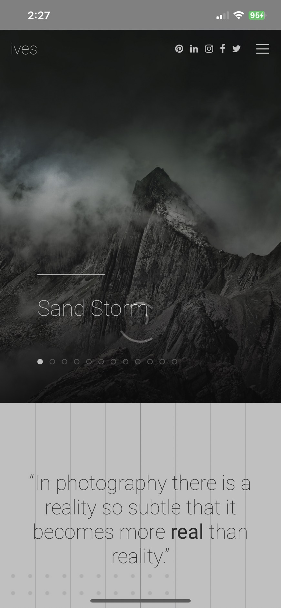

後台展示也與APP相同

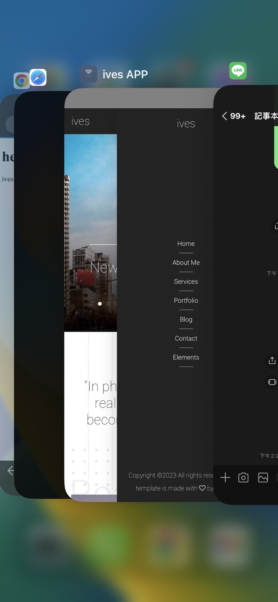